# Workflows

> “I'm not a great programmer; I'm just a good programmer with great habits.”
>
> - [Kent Beck](https://en.wikiquote.org/wiki/Kent_Beck)

- **Workflow Definition**

> “A workflow consists of repeatable activities necessary to complete a task.”
>
> - [https://fluix.io/](https://fluix.io/help/workflows-and-processes#a_2500118779338141)

Learn the skills required to work a collaborative software project using only
Markdown. Limiting your projects to Markdown lets you focus on the big picture
without getting distracted by more challenging code.

<!-- no toc -->
- [Workflows](#workflows)
  - [Abstract Workflow Flowchart](#abstract-workflow-flowchart)
  - [Detailed Workflow Flowchart](#detailed-workflow-flowchart)
  - [Learning Objectives](#learning-objectives)
  - [Suggested Study](#suggested-study)
  - [Lesson Plans](#lesson-plans)
  - [Deliverables](#deliverables)
  - [Study Tips](#study-tips)
  - [Setting Up](#setting-up)
  - [Code Quality Scripts](#code-quality-scripts)

## Abstract Workflow Flowchart

> It is an overview and a big picture of Git and GitHub workflow.
>
>  >
> [Abstract Workflow Flowchart Source](https://viewer.diagrams.net/?tags=%7B%7D&highlight=0000ff&edit=_blank&layers=1&nav=1&title=HYF%20abstract%20workflow%20v1.0.drawio#R5VtZV9s6EP41Oad9CMd7yCNJgKQXKA20tH2TbcV2sS1XlknSX1%2FJlhfFzkY2LuVwSDTa7Jn5Po1GoqX2g9k1BpF7i2zotxTJnrXUQUtRlI5q0A8mmWcSWdb1TOJgz%2BayUvDg%2FYFcKHFp4tkwFhoShHziRaLQQmEILSLIAMZoKjabIF%2BcNQIOrAkeLODXpU%2BeTdxMeq50SvkQeo6bzywb3awmAHlj%2FiaxC2w0rYjUy5baxwiR7Bsyf7EXUCQfmFSLabus50VCXIQzySMIIGaym9uv44fhaDDK2gx%2FXLXHMEJZK5cQpp%2BLlnJFfx2PuIl5ZqGAFobAev6BEnyVkATDHvQdLwnKMZ6gGXsENg3j0p5z2nOS9jwzYSpmHW88C4Yx73Q7esyl4TO0R2HTWNPp9MxP672QP5gX0j8E%2BEGC3dizvWL0z9gBofcHEA%2FxscR3oE2K17gasOIdU0TaN%2Fexp9H8yb95Nq4%2FfYl%2Fg6%2B9%2Fx7vvrVLKwSzPvR9NmNapF%2B4NYTa1aMVnoJhSNbNms9UG3puvxgjU3aV259PFyMtMj8N73kX6QX4Caw6RkzmuZ9ilIQ2ZIPILbU3dakNHyJgsdophSaVuSTweXVMMHqGfeSnXhWikDbrTTzfXxDxaSEmcLYAhzUvKVdUew1RAAme0358lLacw5vTgsqL0xJinVzmVuBlnHMh4LB2irGVqvW4WptV3Hsh3wa68VMew6H38Kg%2BjId%2FcusJKjZ8Om3PpF8ckmojE0xQSATlG78TlFe045TCqJtLshHNsm68fslAFld6taE6SX%2FqfccwQBSe%2BbPhUh4hClzEVLFY9%2BHaI8PE%2FJjXUAVlU4uPU3ZY05CKK0rZxRGrPkdfWpK6XW1Qc1Bac66YqmEU823mfw2uu9wlO7Lgked1j5S1Bo88mEMqSx1yO7fZg58Wxr5BdGGkPVY6GyNm2qaPgighEH9c6V41cNVcbq%2FuJUn9%2FhGdSNe7J%2FYiuVPTILRpgMOLCNPIwkEh8C9Laa%2FUsURLZZsbhCKu2V%2BQkDmP1kBCkKh3qlY8%2F876n%2Bl58QcfLi0MZkJpzksZ7PM4S9naUjF1PYu%2F5uzz99vQuJ%2FfdxPTSD7dSr97X%2FKFlADsQLJCbVrWjqlqpd0x9GlY8iLGins3orqOCtZDXFsC8QCwsGtb6Enbhhh1bn%2B9kTeHoyxpazldakCjdjA0nq%2BKMhrMaCJsQ9zmVH%2BRdsUf2u2q%2FGNG8xtbHFLfpw2SyAaEWpPtVJgPSD4jd19g9J2eaHFiDGPkv8BsrzbxPYvEB5srAnHshQ6by4XWc9y84pySGAVaLFnyCMS4ivDWEqO%2BITHmC6J0JhU74jzW58WNuZOPfo%2B8lOzyJmgyiemzLmKyeIjXw1R7H3zLg53T8a3ebQh%2Fjkq43QZLHh%2F1B0evviF6z99UWKMfDmb0EwQMIXx5AaHlFrJX7jf%2BJyDUNDG10ghC%2BZggNFYFPXtOrYzuHi%2FHd5ePu2QwYGhfsMxxq8iD2SB2iz1nxd6ic%2Bxq47WwrFhQbzBgLnvtwsodqCP6T21vmrER71TNZC6Mo3fXDJTRVW2gfa3iclNK7x2S%2F%2FmG5J9j%2Fo2w%2F%2FKt0M7sD2z736F3%2BdT0Li9PTzRvajc1Y4gOsleUTGA9O6nhq82xY36g2mwpVAtS9UvzDjN%2FnDgCYfMD7WOWFfvYbOJtlrXDc92vJIjyKfjSWZx6HmUbK2%2Ba4JOVN0WGctMJ357Y0EJB4JF%2FhhA19eSEqJ0Ce8ty7kXdqVJLOdTWY3LT5NKOAa7W1QWPUaUjB6bK4cAeJbG7xXnuewO%2FqjSk%2BI8L%2FuW73X1kNcRt8%2F24buvlUdM2qfHN%2FOWYtFYU3kjGXN406aZuyGrcpaUzSe2o4pK248b%2B8Blz%2BZ%2FI5R39AFPTxJXqmAeYjefnTSvX2wl1jnm9YBXUq5Sw6hrCoQMdWRfPY2Tllam8xYGKnPL%2BI6ZGfR3wAkRtTY2S9HmqB3Xl4hmgmKR2sSC%2Fg2XDXRfQm%2By6b9XBge857KormwVS%2BukxyvAs4F%2FwisCz7QxLkL4jMNPxmItHzASpUfReSx80uvhKZNfvevKb1XySVvXy8pIjX73bEXkrB9Cu%2FiyuiorYfy%2Br2yq4HiZeZ9O%2F0%2Bh88Ty4MTrf0%2FpFi%2BVV%2Bszw5X8kqJd%2FAQ%3D%3D)

## Detailed Workflow Flowchart

> Detailed workflow steps on remote repository (GitHub) and local repository
> (your computer).

Detailed workflow flowchart image (click here)

 

[Detailed workflow flowchart source](https://viewer.diagrams.net/?tags=%7B%7D&highlight=0000ff&edit=_blank&layers=1&nav=1&title=HYF%20Workflow%20Steps%20v1.0.drawio#R7V1rd%2BI2E%2F41nNN%2BgOO74WNCNhvaJJtN0jeb%2FdJjQIAbX1jbbJL%2B%2BleyLWxL8g3kC9n2tA0IWbaleZ4ZzYykgTy13z57xnZz4y6BNZCE5dtAvhhIkiwIAvyDSt6jEmkylqOStWcuozIxKXgw%2FwVxYXzhemcugZ%2BpGLiuFZjbbOHCdRywCDJlhue5r9lqK9fK3nVrrAFV8LAwLLr0yVwGm6h0LOlJ%2BRUw1xt8Z1GbRL%2FMjcXL2nN3Tnw%2Fx3VA9Itt4Gbid%2FQ3xtJ9TRXJnwby1HPdIPrkzv9BryYJljGH%2FRvWi6482wUb14tKHg0beKjs%2Buav%2B4er2cUsqvPFWxuO%2Ba8RmK4T1byCj%2Fbs7rzLXbDz4EMJ58Bamzt7IF1eoK%2B3YOtG116bC%2BD4cVfczB5xqfMClrO4tU0QoLE4g1fDf19fX0dW%2BLvpjBYuatN04P8Cw7J33sY3l2ZYEbVz9Xw5fAJz3wwAq6kNfMx3%2BJir8DFHc5C58B49JOOqtRlsdvP41tk33b8magNL39Ps%2Fcm6ftE%2B%2F%2FHV%2F2H8df7n4%2B3%2Fhsko2G9TYFmo6fAr%2FBCPRubX4tb2MuQBJyi7K74T1fT47udyKOsz53E4v5jcXK7Xf9zElwg%2FDWsH0oLhB%2B9YgkMZBKgRYSCfv25gbz9sjQX69RWCFpZtAhtJlQg%2F%2BoHnvoCpa4VSFcqsfL4yLYsoim8LvAC8EUApeUkx1bWfgWuDwHuH1%2BFWtPiNYr4YjjGDvCboE2Vca5OGnjqJS40Y8%2Bt981J6AOOeZfeyqj2eP%2BvBt2vPfJ89bsBu%2BPA8lMp7GSwhbcRfXQ%2Bicu06hvUpKT3PjkNS59p1t3Hv%2FwOC4D3mQGMXuNmxqdPB8Nmg2C9AwUvFnRUY3hoEBfXi9tALpkaaHkEPWJBjfmZ5k%2FtQ0AL%2F8Hh2%2F0iNRyTImLIlQso3xhbVs9%2FWSG2NVpb7utgYXjDyYXcEf4s5QKk3AhQ6cqVeVvSs1KsqQ%2BoFhtBrTYm82oWEgzcz%2BJb6%2FIyaGqnxt4u3uOXwyzv%2B4sDX%2FZb%2BkroKfU0uC7%2Fh6zijCdsmZWhSeoUmLKkJmi7AykSGimAMkC2iWQFSAK4ThDaWFRsb2o8dMk5gJ8qrlRBaeUmRtkZ%2FfdsI74%2FbgM8XNRP9vPXcuQVsSsoq6ac0rFGjWCyFpgCqiiRANQZAJQZAx00BVP8PoLUAqlQEqNYrgCoUQL9sgYPu5ByJT9P3dyAfny5q%2F7MZXO3mx2M0a1UO0LxwMlEuGtSoutA7wIoi1ZFtIBajT6yHPox0oQbSD0fs7Lskb%2Fx3YfFdB%2BDvH4s%2Fln%2F%2FGIrjqhaqwBuz8aV3rhkCC4ucOCakShEJaYmeNb6OEJj9g1SSIWaXyBQddCFTnJlZo4eZ%2BfJSr5hZo4bibLkMvVPofxtErRHFIsdERLFzD7PrMcT9aAZwGCX41MIF8BeeuQ09O2HBNXIQ%2BdHnG9MCPvoprnznuchx4ecQ%2Fimy%2FESYVGF5tUWWl2i5uHU%2FOvEjOUqN%2B3QaSi5DIva%2FhFZ79OiiRljxtTxJVaZmlT0dVRkmFr%2BhMNoLF5bA%2BKGO1jQaIdmyMBmp2WaiF6d0Dd2YRMKE0ViO4koawxXd1coHxyq3q%2FNvN9vh1ezt5XE6fHkSv18ba8ZklKDJBECYE9EPQz%2BUI8iygqht3yKmJDjzGVSmvRZnUQmsntOoKp5F1YRzL4EmybWBpioYnYdCi6sAF75%2FSoJn%2Ft4a8MKoirCwoEaGrVxSkudtXHu%2B86s66UtUryBMp02qXpUwhSVdGakirX1ZXsuJ3JT27cQePkRlHopn3pCVqurGnjku6ZDM1ApN3QzaeNrdazPA8I3cJoaNcBm2h%2B423HnWvjRztzYs7Ybhrssk3LXJSB7TcJfbdKlItHvslExt3liu6uLEyQt9wTI9ijPHD6LwgbO1%2BcI4bFAw8Q0%2BDEIVjLIyhLbq9JTGnQIyhcHnDATzjeXUmF1exrPVdp2hzMmReprYlmiP5cOrGSw2sacsVpfO3N8eiWvbCPOMbMMPUBpUDq6FuWc46O4NWAYbsHhxd%2BhjtWc5PY7RJgTHKBLD36brLRKMTM%2B5umCcUubITPXFhpijkBHKqWPSL%2BrQGSNbDlJBYIN06gEjwIkNDniluIDCJ0kREczxRcQMICoeOoYNyEnAsTjPk6328S%2BRaRASdlOm8c9KzmsO%2F91a%2FJwMjOxQLsHK2IVS1Qf6mFSkD7lfiYL4uTnRR8ZqiX0MR7BIylhoiEeKRS3DL6n03kT01p6xNEHSRpz42wXpSFnSEZlGR6ukQwf5umChPNYghj4W6ZPO3sLkUs5Caq9YCD83LxZC6cnoOZ1leKm9tUCQOD0Dw3%2FhNN2oTh%2B9JQpZHeHobHdM0UmaZnHcvYgaDgpJCiO9thWUxCCzMUqlAe6o6jvhb8GwA%2FIKme4v4mzFkmj8mecZ76lqW1TBz7%2BRSmZBisQSI6K%2BrAhF9eGH6Am4Rk2xj5JBkXPMXrdfUrQ2z%2BU0NHDX0Rq5NBwMy1yjxWoLKE8ASv454hRzYVhn8Q%2B2uVxGyAO%2B%2Ba8xj5PJ5fO4g2Hj6vlAvaABlJvQQstwIT8wVlLFKxrjpxmklwbmxMglkUj04JOMMhQ1QiqyLTQXUFf64dypa2e1mXNRndz65d1RaMMoTNLpHNGHjmKxAHOBt8YHzkpb8MWyycn4vTCR0TuD%2F61Mx%2FRjHxwxvU4ZwijFppotXDnz5gStYtLYkGSmVcyKCoqCki9cx6G%2FH4nsFYl9P8y8ubuqa02ResXdMl%2FX2oWbQjIB1am7RHj%2BuoOMH6A3nCLHGa0nPh5uNQK3ObPZVqP5Ci9C%2FzipvAem%2FtRlnkPm522aoZihyqmsah5h2u7BQZ4jLZ%2FxJAspUZlkm2g3CZ7dP%2FRsuOP1IzUdv5V9T52sBakup9zzaNoXJYmrmj7zYkezV7Bs2IIvZzrrVIVDbgVr5t5h5Xq2weEewPNcz%2F9vkhAxI5HNL6ojhq0hy4w5gkgtJeJnbmjdEl%2B92P6h0bh2kgoLlXEHziO2htb1Eg2ds%2BaNG2WyEsoP55hL822AY3Mx3%2Fyy0TmdXDA0ZkTxWbMZtanZDG74FO2qXHrZW1WHBPt500vVzEOlJXoRJTyTwM6wccv8wjenMd5xIOSXFVruP4jzk%2FzAWEcmEhxLo2ZukhG2mk1LQq23mpTUG94SBV1F8e0Kvhi9zY0GtG7Zqy1%2FRyvsxdxuhGEbMet1tuCC%2BTSlHrpyz5uS43l7CMB2zzC77TJKp%2Ba7lGKx88Lhq5hW2QcPYPcpugojjlAk0jV8b7KKG8dmmxbLe4%2F9HnzDE5GSXbi2HWpHG%2Fg%2B2jO6Zr4vvnxoU7o1afEX06yyWCnE0dR6An329WbtzX68vz0Hwe395O71%2BRtzE5L2SYUzQagyTRDMt%2Be%2BkdpxEzRWlPhwIN%2FtwpyByFxebAxnXRBKYsN4GzbRBDLFPiFT1rLAVPHcvbPIo0Y7ZvLShU57%2Fn5URm6bkRStaka%2BdshmP5PJcVbGO%2FOC5mwOrTfbvh1gjvLxePct1FdZQNWaAiqMBGHSeytYY1kyvKN%2FiX60gbcO9arrrCwTbTN5WpG16hmlbSldWdJYQThskGaCcM3tctrNOQA5hCTWIqRmdCxvlmKY5p2G4DTSRS5o2SYadpFrfI3%2BB9f6mSyQS9jpl43DaRIRYp0w4nCtLuHX%2BAZFPt1eVB3dRg6JqRuoq7X8uimpEGVtnBELnXXuUqsn0OB1mk3sB%2Fv05f7Py%2BsvT7DOw%2BOnu4eqAgN7MxgUpJDnH5hV3b5gyVRWo1ZZsaJS1jWUKcvwfawq8Zlz9XVajZg%2Fkc4Bx5Rh0YgMqVKa8u%2FJ3doz9XwGeQN9uA1S5PUr9Q5KvC2Qo0aylB5qaY34WJUcIri7P6ZtWD9znEpvTY%2BGt%2BtX1QpuRaVNb7%2FSp9lNmbsl%2FHYHPBO%2BO1IhDVEE%2B%2BCRyt6%2BpvOmccbqOGuvjCVCRvidxFLEhXwTeZKthSDhJOeGlAYnyCNBUieC0JXPfB9aHADQJ4agc13hn1l0MtSHpyPSOmHSkdoQHTFRlq%2FS5uTgH20CV8vSQP%2FQ194D2w0ALVroTF7fDFzUFeRvv0Xa7%2FfKQl2e%2BpG%2FEUTC0XmztLTopqz1tNxREjmW5rLG3tyB01pdibSXWfHwpjQk%2BxCug3iOFhwOkrof7msXzpvgFYXiho59hnWmrr3dQXX5e6GAUfAqdVkfJWCNpyxqvZMjvon12d34iO12j96Rj2ive0XYeiKOwtCETfkEmeLCSuFq31LnbEQz0uGZ9ca8TeijhoL2zv5F5n62sF93hHT4vsAPIuH2QxuX%2Fz7e292HOhdAFPT9Cr1CeEujhtLX2XZFPxLtepBnzjjllN1jLZ1yOtHljLRoAtEEvwBgUX%2FknRgg5KWIN7SXfzZXt2B73g%2FDGGOpgjUwbnUS0g03tH6sTyHuy11vnW3AXfjcKSDfxElCpMEOmaQtZNvsR%2Fgw4CV97EzwTloFbz%2F2%2BurJRtadHXbNVvaqJmXEZahK0n4RRt2DZknFARuTqcYaPiFdoknHTSUARUdyF509xOmQbnfpRtfsbKdNemnYZy6KAjmbyDl0e9wmxbAyiH4FiimCQPmEgvtW%2BWxa0MekwODhqX2StUzunE011TS9cFhfm%2BfnvnWrEkWPU3CZQer6CwV6tPqlEDvlerz%2BmltBxPss9mJ1QeH7p3DwZIaXzUJRDY%2BpoPbmDbemyCTkRvr4%2BMOw8%2BN3aX3ZmFaUKctnrNE6kRVLFmUpf1iPUooSK5p8OrPoHnjmMOLKNSl3j32O%2FhPIAx2UCWFTHa5KqaYaVqUi7eg7wFRn6Nu56y2BN4zt9bPwFt5vw2G6%2FHemBi5V5Yc0XW%2FiMEOJgneeu%2FaA7zczg%2BiYK0VZIPfTGUraeITdzG2sMWbDvXTlyYfbtbhuBuIBi0v7aZVVdZUmVpkoyMpxVtk%2BvkLaChUDLDSHi%2Fq4pKl2dzQu7OvaKUQ5qZJh%2BuIgN1XbfveBtRpksinNQzIae0GWMt7EN2FKbYSXyJUxpa5T3jd%2BZEkn9IQLr4g%2BbmSFVXO9rRK9rYuMvKmmVkGx%2B5l1OtbpuLZaylkvStEuVwZaW9Y71iA44RjvIlCb%2BCUydZlsiZ%2FtfnX%2B7WY7vJq9vTxOhy9P4vdrYz08bI3uYkFS%2BofxlnHcdaPeIvcWdtcoBA2%2FQxUTU2siC%2FIhplbd4xFFAYfM8aJXqfh8RIk4QIKoP8icj9jKZjSFY8Mp2Xbm7w2p6IBZxqISfBTtsoltP%2FItsaOTbRszJUhPjaoqrN08BJ2ZddeU1Safdiy%2B0xVwVfeDrU14WQ4SVfEQ7mPYCNhOPdraUOXDrA3GSaJq9plEmWipOVLkfBJ3vqsyZ9FBMx5MIVXHW89%2FE6KVfPhPb92c98BYIgxchke93IOfJngdtObt7K%2FakNWsR6fVnRfZuKGNiRPbebGW1ujahi7UPXUOTdvvCdYfPUIub6yvR1pQE3wXqh25sDsiRuDVPvDyFLlPnJAmc4vcx3Rz9CytrGYEvR9nKzCdAhJj1zvmCLSUoqaRC2ZlUqaqkhzpIoAkX%2B2QSV6uOTox57%2FleieUv68oWW07VDDjtbEWlylRdARiFj5OeOUxA7g1F8ibtNvmy5PhHHkPPDXLuYXhQyHYLyN%2FQTUNNK5JAgYS%2B1h3w9J%2FwCKI5laGs9fsG2ChRmw0jAEwbBuJPSV8%2Fdg7rjHtDdU1mRiuaSyPF3Od6X4TuBrSC796LhrshD5RGPHGXQJU4%2F8%3D)

[TOP](#workflows)

---

## Learning Objectives

Priorities: 🥚, 🐣, 🐥, 🐔 (click to learn more)

 

There is a lot to learn in this repository. If you can't master all the material
at once, that's expected! Anything you don't master now will always be waiting
for you to review when you need it. These 4 emoji's will help you prioritize
your study time and to measure your progress:

- 🥚: Understanding this material is required, it covers the base skills you'll
  need for this module and the next. You do not need to finish all of them but
  should feel comfortable that you could with enough time.
- 🐣: You have started all of these exercises and feel you could complete them
  all if you just had more time. It may not be easy for you but with effort you
  can make it through.
- 🐥: You have studied the examples and started some exercises if you had time.
  You should have a big-picture understanding of these concepts/skills, but may
  not be confident completing the exercises.
- 🐔: These concepts or skills are not necessary but are related to this module.
  If you are finished with 🥚, 🐣 and 🐥 you can use the 🐔 exercises to push
  yourself without getting distracted from the module's main objectives.

---

### 🥚 [0. Local Development Without Git](./0-local-development-without-git)

Practice the foundational workflows of software development by learning to write
Markdown locally on your own computer using Visual Studio Code (VSCode), the
Command Line Interface (CLI), and NPM scripts to automate your code's quality
(formatting, linting and spell checking).

- [ ] 🥚 **Folder Structures**: You can explain how files and folders are stored
      in your computer and can find, open or create files in your computer
      without using the Command Line Interface.
- 🥚 **Command Line Interface (CLI)**: In a Unix shell you can ...
  - [ ] Open a new terminal window
  - [ ] Navigate up and down directories using `cd`
  - [ ] List the contents of a directory using `ls`
  - [ ] View the contents of a file using `cat`
  - [ ] Create new files using `touch`
  - [ ] Create new folders using `mkdir`
- [ ] 🥚 **Markdown**: You can write a document in Markdown with no syntax
      mistakes that renders into a well-formatted document.
- 🥚 **VSCode**: You can complete these workflows in VScode, and can use
  keyboard shortcuts to complete them all:
  - [ ] Opening a repository in a new window
  - [ ] Opening the VSCode terminal
  - [ ] Adding a new file
  - [ ] Adding a new folder
  - [ ] Deleting a file
  - [ ] Deleting a folder
  - [ ] Previewing a Markdown File
  - [ ] Formatting a Markdown document
- [ ] 🥚 **READMEs**: You can write a README file that describes the project you
      are working on, why it's helpful, and how someone can use it.
- 🥚 **NPM**: You can use NPM commands to verify your code's quality, this
  includes ...
  - [ ] Using `npm install` to install a project's dependencies
  - [ ] Reading a `package.json` file to find which scripts are available for
        the project
  - [ ] Use `npm run <script>` to execute an npm script
- 🥚 **Formatting Code**: You can use Prettier to make sure all the code in your
  project is well-formatted:
  - [ ] You can use the Prettier VSCode extension to format a document while you
        are writing it
  - [ ] You can use `npm run format` to format all of the documents in your
        project
  - [ ] You can use `npm run format:check` to make sure all files are
        well-formatted
- 🥚 **Linting Folder and File Names**: You can ...
  - [ ] Use `npm run lint:ls` to check all folder and file names in your project
  - [ ] You can fix all linting mistakes reported by `npm run lint:ls`
- 🥚 **Linting Code**: You can ...
  - [ ] Use `npm run lint:md` to check all Markdown files in your folder for
        linting mistakes
  - [ ] You can fix all linting mistakes reported by `npm run lint:md`
- 🥚 **Spell Check**: You can ...
  - [ ] Use the Code Spell Checker VSCode extension to correct spelling mistakes
        in your Markdown documents while you are writing
  - [ ] Use `npm run spell-check` to check the spelling in all the files of your
        project
  - [ ] Update `.cspell.json` to add words that should be allowed in your
        project
- 🥚 **File and Folder Naming Conventions**: You can ...
  - [ ] Identify and follow the naming conventions for the project you are
        working on.
  - [ ] Use `npm run lint:ls` to check that all files and folders follow the
        project's naming conventions.
  - [ ] You can correct any file and folder names to make them match the project
        conventions.
- [ ] 🐣 **File Extensions**: You can identify all of the languages covered at
      HYF and give the correct file extension. You don't need to know the
      languages, just recognize them.
- [ ] 🐣 **Touch Typing**: You can write a Markdown file without looking at your
      keyboard to find any letters, numbers or special characters. (slowly is
      ok!)

### 🥚 [1. Local Development With Git](./1-local-development-with-git)

Practice using Git to save and organize your development process. You will learn
how you can use Git to go back to previous versions of your project, and to work
on different changes in parallel.

- 🥚 **Git**: Using the CLI you can ...
  - [ ] Initialize a new git repository with `git init`
  - [ ] Stage changes using `git add <path>`
  - [ ] Check what is staged with `git status`
  - [ ] Commit changes using `git commit -m <message>`
  - [ ] Display your repository's git history using `git log`
  - [ ] Create a new branch using `git branch <branch-name>`
  - [ ] Check out a branch using `git checkout <branch-name>`
  - [ ] Create a new branch and check it out using
        `git checkout -b <branch-name>`
  - [ ] Merge changes from one branch to another using `git merge <branch-name>`
  - [ ] Update current branch (your branch) from _main_ brnach:
    - [ ] Check out to _main_ branch using `git checkout main`
    - [ ] Pull changes from remote repository using `git pull`
    - [ ] Check out to your branch using `git checkout <branch-name>`
    - [ ] Merge changes from _main_ branch to your branch using `git merge main`
  - [ ] Merge changes from _main_ branch to current branch in one step using
        `git pull origin main`
  - [ ] Return to a previous version of your project with `git log` and
        `git checkout <commit-hash>`
  - [ ] Stash and retrieve uncommitted changes with `git stash` and `git pop`
  - [ ] Display list of existing remote URLs using `git remote -v`
  - [ ] Add a new remote repository URL using
        `git remote add <shortname> <remote-url>`
  - [ ] Update a remote repository URL using
        `git remote set-url <exsit-shortname> <new-remote-url>`
  - [ ] Rename a remote repository URL using
        `git remote rename <old-shortname> <new-shortname>`
  - [ ] Remove a remote repository URL using `git remote rm <exsit-shortname>`
- 🥚 **`.gitignore`**: You can use a `.gitignore` file to describe which files
  you don't want included in your git history.
- 🥚 **VSCode**: You can ...
  - [ ] Use the _Git Graph_ extension to to visualize your repo's commit history
  - [ ] Use the _Git Lens_ extension to investigate your repository's commit
        history
  - [ ] Explain how the file tree in VSCode can show you which files have
        uncommitted changes
- [ ] 🥚 **Atomic Commits**: You can save your development progress using small
      commits with clear and helpful message.
- [ ] 🐣 **Feature Branches**: You can organize your development process using
      branches. You can create a new branch for each part of your project and
      merge those changes to `main` when they are finished.

### 🥚 [2. Local/Remote Development](./2-local-remote-development)

Learn how you can connect your local Git repositories with a GitHub repository
to add more structure to your development process and to share your projects.

- 🥚 **Licenses**: You can ...
  - [ ] Explain why it's important to include a license for your code on GitHub
  - [ ] Choose a license for your projects that matches how you want others to
        use your code
- [ ] 🥚 **GitHub SSH Key**: You can connect your computer to your GitHub
      account using an SSH key, clone using the SSH link, and push/pull using
      your SSH connection.
- 🥚 **GitHub Repositories**: You can ...
  - [ ] Create new repository on GitHub
  - [ ] Write a description for your repository
  - [ ] Turn on GitHub Pages
  - [ ] Configure your repository to block pushing to `main`
  - [ ] Configure your repository to block merging to `main` until Continuous
        Integration (CI) checks have passed
- 🥚 **Git Remote/Local Connection**: You can ...
  - [ ] Clone a remote repository to your computer using
        `git clone <remote-url>`
  - [ ] initialize a new repository locally and connect it to an empty remote
        repository
  - [ ] `git push` command is used to upload local repository content to a
        remote repository
  - [ ] `git fetch` a primary command used to download contents from a remote
        repository
  - [ ] `git pull` command downloads the changes directly and then applies those
        changes to the current working files
  - [ ] `push` and `pull` changes between remote & local branches
  - [ ] You can distinguish between `git fetch` and `git pull`
- [ ] 🥚 **Pull Requests**: You can create a pull request between two branches
      in your repository and merge changes without causing any conflicts.
- [ ] 🥚 **PR templates**: You can use a PR template to add a checklist to all
      of your PRs so you are sure the code is great before merging to `main`.
- [ ] 🥚 **Continuous Integration**: You can use GitHub Actions to check your
      code's quality before merging a pull request to the `main` branch.
- [ ] 🐣 **Local/Remote Branching Workflow**: You can use a branching workflow
      that keeps mistakes away from the `main` branch and prevents conflicts
      from happening in GitHub. For each contribution to the project you can ...
  1. Check out a new local branch and write your code
  2. Check out `main` on your local machine
  3. Pull changes from remote `main` to local `main`
  4. Merge changes locally from `main` to your new branch
     - Fix any conflicts on your new branch before pushing!
  5. Format and lint your code
  6. Push your new local branch to your remote repository
  7. Open a Pull Request from the new branch to `main`
     - Go through the PR's checklist to make sure everything is correct
     - Make sure all CI checks pass!
  8. Merge your new remote branch to `main`
     - You can delete the branch after it's merged if you want to

### 🐣 [3. Remote Collaboration](./3-remote-collaboration)

Learn how to collaborate with a group on a single project hosted in a GitHub
repository. Practice using GitHub's project management features to organize your
group's tasks and to double-check your project's code quality.

- [ ] 🥚 **Contributor Guidelines**: Your group can define contributor
      guidelines that describes how everyone can add their work to the project.
- [ ] 🥚 **Code of Conduct**: Your group can write a code of conduct for your
      project that describes how everyone should communicate and what behavior
      is considered unproductive.
- [ ] 🥚 **Repository Contributors**: You can add group members as collaborators
      in a repository.
- [ ] 🥚 **Issue Templates**: Your group can use issue templates to make sure
      all issues are complete and relevant to the project. in your repository
      and merge changes without causing any conflicts.
- [ ] 🥚 **Code Review**: You can use the PR Template and CI checks to review
      another group member's code before merging it to `main`.
- 🐣 **GitHub Project Management**: You can ...
  - [ ] Use issues to define tasks in a group project. Each issue should have a
        helpful title, complete description, and helpful labels.
  - [ ] Use a Project Board to organize a project's issues
  - [ ] Claim issues and track your progress with the project board
  - [ ] Link a PR to your claimed issue
  - [ ] Assign someone to review your PR
  - [ ] Use GitHub code review features to discuss your code with your reviewer
- [ ] 🐣 **Fixing Merge Conflicts**: You can fix merge conflicts by selecting
      which change to keep, or deciding how to combine them. If a conflict
      occurs in a GitHub PR you can pull both branches and fix the conflict
      locally.

### 🐥 [4. Open Source Development](./4-open-source-development)

Explore the wider world of Open Source software by learning how communities of
independent developers write and maintain the code we all rely on.

- [ ] 🥚 **Finding Issues**: You can read through an open source project's
      issues and determine if there is one you can help with.
- [ ] 🐣 **Commenting in Issues**: You can productively join the conversation in
      an open source projects' issues.
- [ ] 🐥 **Opening Issues**: You can open a helpful issue in an open source
      repository, following their contributor guidelines and code of conduct.
- [ ] 🐔 **Contributing**: You can create a fork of an open source project and
      open a PR that contributes something helpful and follows the Contributor
      Guidelines and Code of Conduct.

[TOP](#workflows)

---

## Suggested Study

[CLICK HERE](./suggested-study.md)

## Lesson Plans

[CLICK HERE](./lesson-plans)

## Deliverables

[CLICK HERE](./deliverables)

## Study Tips

expand/collapse

 

- Don't rush, understand! Programming is hard.
  - The examples and exercises will still be there to study later.
  - It's better to fail tests slowly and learn from your mistakes than to pass
    tests quickly and not understand why.
- Don't skip the examples! Understanding and experimenting with working code is
  a very effective way to learn programming.
- Write lots of comments in the examples and exercises. The code in this
  repository is yours to study, modify and re-use in projects.
- Practice
  [Pair Programming](https://home.hackyourfuture.be/students/study-tips/pair-programming):
  two people, one computer.
- Take a look through the
  [Learning From Code](https://home.hackyourfuture.be/students/study-tips/learning-from-code)
  guide for more study tips

### Study Board

Creating a project board on your GitHub account for tracking your study at HYF
can help you keep track of everything you're learning. You can create the board
at this link: `https://github.com/your_user_name?tab=projects`.

These 4 columns may be helpful:

- **todo**: material you have not studied yet
- **studying**: material you are currently studying
- **to review**: material you want to review again in the future
- **learned**: material you know well enough that you could help your classmates
  learn it

[TOP](#workflows)

---

## Setting Up

> You will need
> [NPM](https://docs.npmjs.com/downloading-and-installing-node-js-and-npm)
> installed on your computer to study this material

1. Clone this repository:
   - using SSH:
     `git clone --depth 1 git@github.com:HackYourFutureBelgium/workflows.git`
2. Navigate to the cloned repository
   - `cd workflows`
3. Install dependencies:
   - `npm install`

> It's highly recommended that you use either Linux or Mac. If you have a
> Windows computer you can either dual-boot your computer or install a virtual
> machine.

[TOP](#workflows)

---

## Code Quality Scripts

expand/collapse

 

This repository comes with some scripts to check the quality of this code. You
can run these scripts to check the code provided by HYF, and to check the code
you write when experiment with the examples and complete the exercises.

### `npm run format`

This script will format all of the code in this repository making sure that all
the indentations are correct, the code is easy to read, and letting you know if
there are any syntax errors.

### `npm run format:check`

Checks the formatting of all files in the repository and throws an error if any
files are not well-formatted.

### `npm run spell-check`

This script will check all of the files in your repository for spelling
mistakes. Spelling is not just a detail, is important! Good spelling helps
others read and understand your programs with less effort.

`spell-check` is not so clever though, it doesn't have _all_ possible words in
it's dictionary and it won't know if you _wanted_ to spell a word incorrectly.
If you think one of it's "Unknown word"s is not a problem, you can either ignore
the suggestion or add the word to the `"words": [ ... ],` list in
[.cspell.json](./.cspell.json).

### `npm run lint:md`

This script will [lint](https://en.wikipedia.org/wiki/Lint_%28software%29) all
the Markdown files in this repository, checking for syntax mistakes and other
bad practices. Fixing linting errors will help you learn to write better code by
pointing out your mistakes _before_ they cause problems in your program.

Some linting errors will take some practice to understand and fix, but it will
be a good use of time.

### `npm run lint:ls`

This script will [lint](https://en.wikipedia.org/wiki/Lint_%28software%29) the
names of all files and folders in the project to check that they follow the
project naming convention
([kebab-case](https://betterprogramming.pub/string-case-styles-camel-pascal-snake-and-kebab-case-981407998841)).

[TOP](#workflows)
